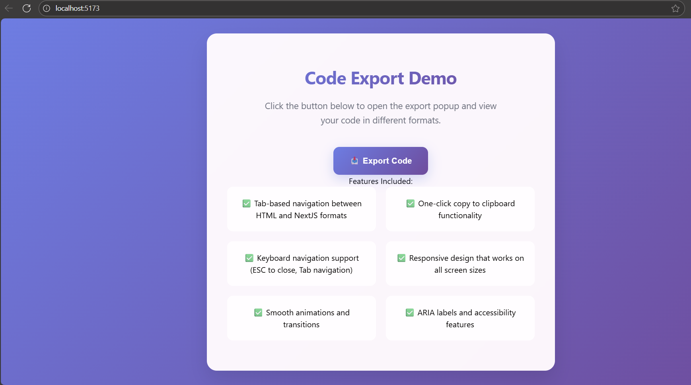
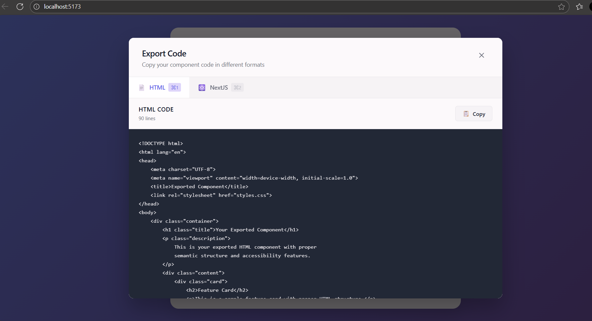

# 🚀 Code Export Popup - React Component

A professional, fully-featured popup component for exporting code in multiple formats with a beautiful UI and smooth user experience.


## ✨ Features

- 🎨 **Modern UI Design** - Beautiful gradient backgrounds and professional styling
- 📱 **Fully Responsive** - Works perfectly on desktop, tablet, and mobile
- ⚡ **Tab Navigation** - Switch between HTML and NextJS code formats
- 📋 **Copy to Clipboard** - One-click code copying with user feedback
- ⌨️ **Keyboard Support** - ESC to close, Tab navigation, keyboard shortcuts
- 🎭 **Smooth Animations** - Elegant entrance/exit transitions
- ♿ **Accessibility** - ARIA labels, screen reader support, proper focus management
- 🎯 **Zero Dependencies** - Built with vanilla React and custom CSS
- 📦 **TypeScript Ready** - Full TypeScript support with proper typing

## 🖼️ Screenshots

### Landing Page


### Export Popup


## 🚦 Live Demo

**[View Live Demo →](https://react-code-export-popup-d5ag.vercel.app/)**

## 🛠️ Installation & Setup

### Prerequisites
- Node.js 16+ 
- npm or yarn

### Quick Start
```bash
# Clone the repository
git clone https://github.com/your-username/code-export-popup.git

# Navigate to project directory
cd code-export-popup

# Install dependencies
npm install

# Start development server
npm start
```

The app will be available at `http://localhost:3000`

## 📁 Project Structure

```
src/
├── App.tsx                    # Main application component
├── App.css                    # Global styles and landing page
├── components/
│   └── ExportPopup/
│       ├── ExportPopup.tsx    # Main popup component
│       └── ExportPopup.css    # Popup-specific styles
└── index.tsx                  # App entry point
```

## 🎨 Features in Detail

### Tab Navigation
- Seamless switching between HTML and NextJS code formats
- Visual active state indicators
- Keyboard navigation support

### Copy Functionality
- Clipboard API integration with fallback support
- Visual feedback for successful copying
- Error handling for unsupported browsers

### Responsive Design
- Mobile-first approach
- Flexible grid layouts
- Touch-friendly interface

### Accessibility
- Full keyboard navigation
- ARIA labels and roles
- Screen reader compatibility
- Focus management

## 🎯 Usage

### Basic Implementation
```tsx
import React, { useState } from 'react';
import ExportPopup from './components/ExportPopup/ExportPopup';

function App() {
  const [isPopupOpen, setIsPopupOpen] = useState(false);

  return (
    <div>
      <button onClick={() => setIsPopupOpen(true)}>
        Export Code
      </button>
      
      {isPopupOpen && (
        <ExportPopup 
          isOpen={isPopupOpen}
          onClose={() => setIsPopupOpen(false)}
        />
      )}
    </div>
  );
}
```

### Customization
The component is built with CSS custom properties for easy theming:

```css
:root {
  --popup-bg: #ffffff;
  --primary-color: #6366f1;
  --text-primary: #111827;
  --code-bg: #1f2937;
}
```

## 🚀 Deployment

### Deploy to Vercel
```bash
npm install -g vercel
vercel
```

### Deploy to Netlify
```bash
npm run build
# Upload build folder to netlify.com
```

### Deploy to GitHub Pages
```bash
npm install --save-dev gh-pages
npm run deploy
```

## 🧪 Testing

```bash
# Run tests
npm test

# Run tests with coverage
npm test -- --coverage
```

## 🛠️ Built With

- **React 18** - UI Library
- **TypeScript** - Type Safety
- **CSS3** - Styling (No frameworks)
- **Vite** - Build Tool
- **Modern JavaScript APIs** - Clipboard, KeyboardEvent

## 📈 Performance

- ⚡ **Lightweight** - No external UI libraries
- 🎯 **Optimized** - Tree-shakeable components
- 📦 **Small Bundle** - Minimal footprint
- 🚀 **Fast Loading** - Optimized assets

## 🤝 Contributing

1. Fork the repository
2. Create a feature branch (`git checkout -b feature/amazing-feature`)
3. Commit your changes (`git commit -m 'Add amazing feature'`)
4. Push to the branch (`git push origin feature/amazing-feature`)
5. Open a Pull Request

## 📋 Roadmap

- [ ] Add more export formats (Vue, Angular, Svelte)
- [ ] Syntax highlighting for different languages
- [ ] Dark/Light theme toggle
- [ ] Export to file functionality
- [ ] Custom code templates
- [ ] Multi-language support

## 📄 License

This project is licensed under the MIT License - see the [LICENSE](LICENSE) file for details.

## 🙏 Acknowledgments

- Inspired by modern developer tools like VS Code and CodePen
- Built following React best practices and accessibility guidelines
- Design influenced by contemporary UI/UX trends

---

